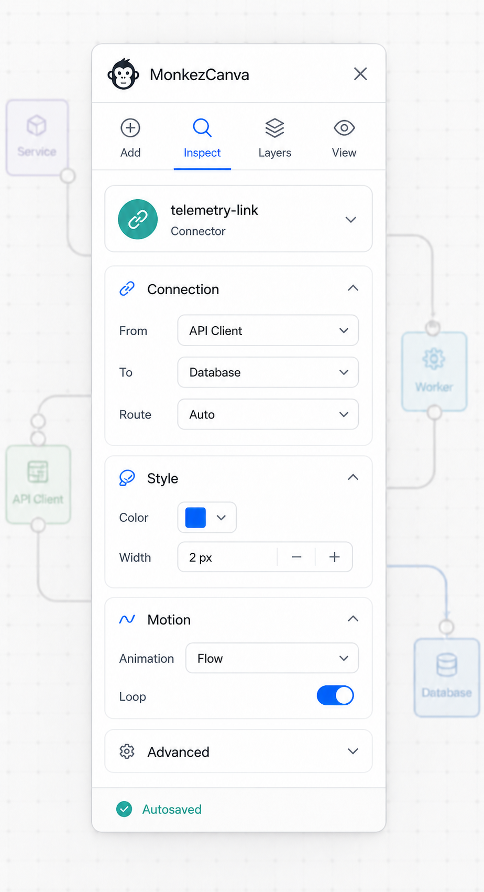
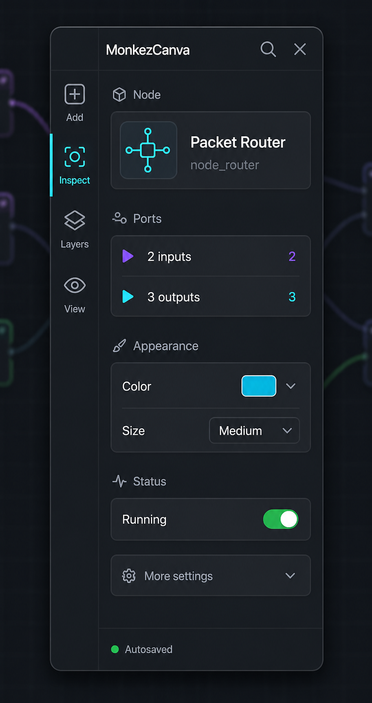
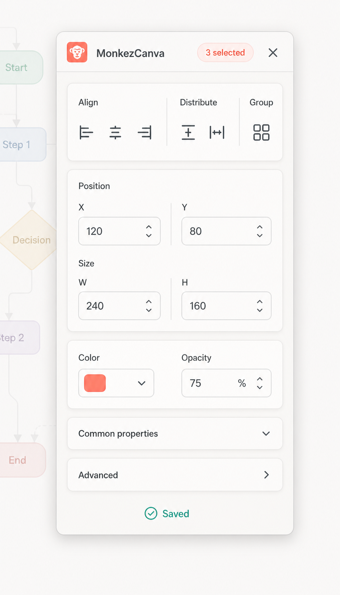
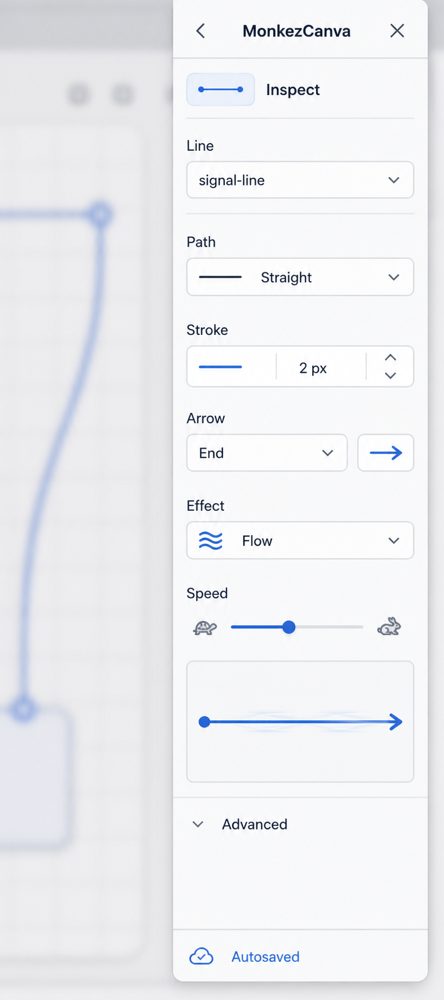
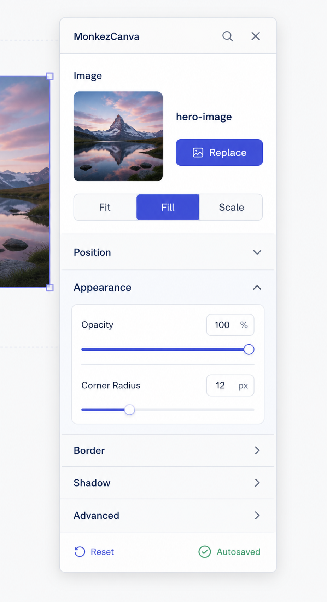

# MonkezCanva Control Pane concepts — simplified set

Regenerated: 2026-08-09

This second concept set deliberately reduces information density. Each pane
focuses on one editing context, keeps advanced properties collapsed and avoids
placing runtime consoles or debugger tables inside the everyday Inspector.
These are design references rather than pixel-exact implementation contracts.

## Option 1 — Light Essential

The general-purpose floating pane. A short icon tab row leads to a contextual
Inspector with only Connection, Style and Motion open. It is the clearest base
for the default Control Pane and maps cleanly to native PyQt6 widgets.

Best for: the everyday editing experience and first-time users.

## Option 2 — Dark Compact

A narrow dark Inspector with a small navigation rail, selected-node summary,
port counts, appearance and runtime status. Typed input/output markers remain
visible without showing a full port table.

Best for: dark theme and graph-heavy applications.

## Option 3 — Floating Cards

A focused multi-selection pane. Quick alignment/distribution actions sit above
three compact cards for position, size, color and opacity. Object-specific and
advanced fields stay collapsed.

Best for: arranging several canvas objects quickly.

## Option 4 — Slim Dock

A very narrow object-specific Inspector for lines. It shows only path, stroke,
arrow, effect, speed and a tiny live preview. Navigation and unrelated controls
are intentionally absent.

Best for: narrow screens, docked layouts and direct connector editing.

## Option 5 — Progressive Inspector

A selected-image Inspector built around progressive disclosure. The main media
action and scale mode are immediately visible; Position, Border, Shadow and
Advanced remain collapsed until requested.

Best for: object-specific schemas with many optional properties.

## Recommended product direction

Use Option 1 as the common shell, then apply the following contextual variants:

1. Adopt Option 5's progressive disclosure rule for every object type: expose
   the primary action and 4–8 common fields, collapse everything else.
2. Show Option 3's quick action card only for multi-selection.
3. Use Option 4's narrow label/control rows and live preview for line and
   connector objects.
4. Offer Option 2 as the dark visual theme, not as a separate feature set.
5. Move Outline, Runtime and Debugger into separate detachable tools so the
   Inspector remains small.

Recommended default width is 360–400 logical pixels. Sections should reflow at
smaller widths, remember their expanded state per object type and expose search
only when a schema contains enough properties to justify it.

## Generation brief

Mode: built-in ImageGen, five independent generations. Shared constraints were
a native PyQt6-style floating/docked desktop pane, readable English labels,
icon-led actions, no browser chrome, no watermark, no debugger/runtime table and
no more than roughly 8–12 visible controls. The five prompts focused on a basic
connector, compact dark node, multi-selection, slim line and image Inspector.
