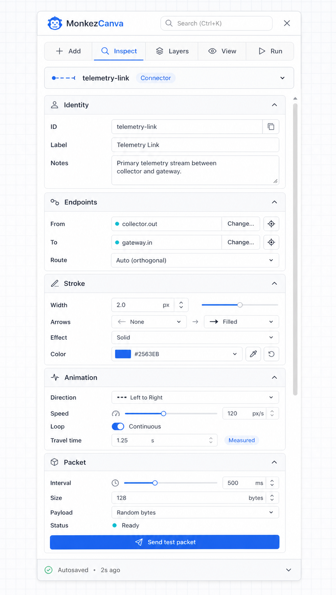
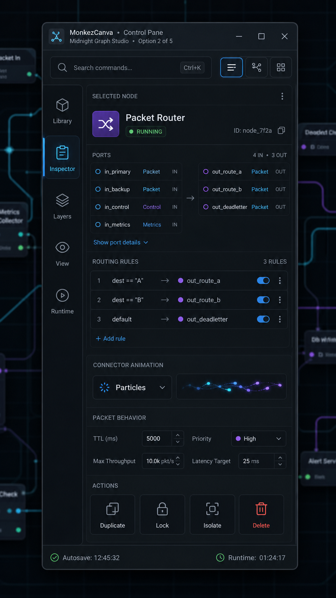
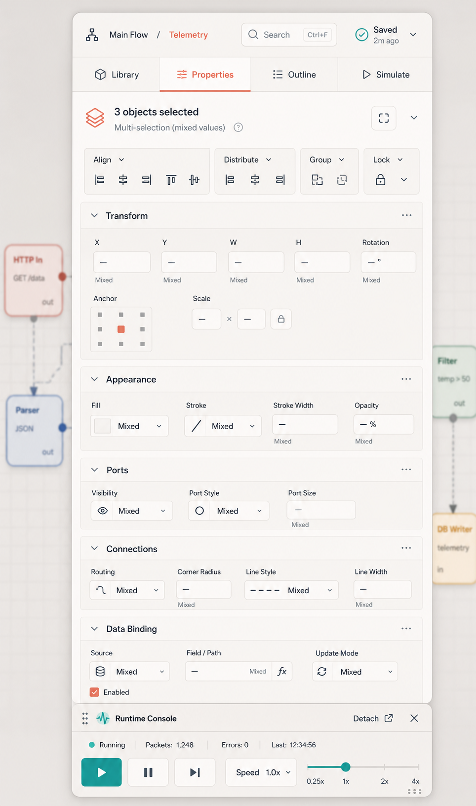
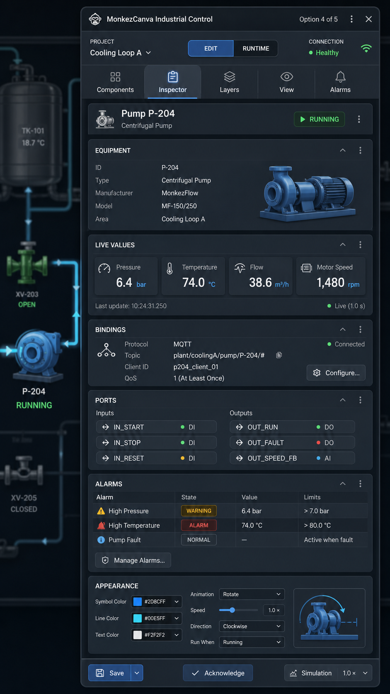
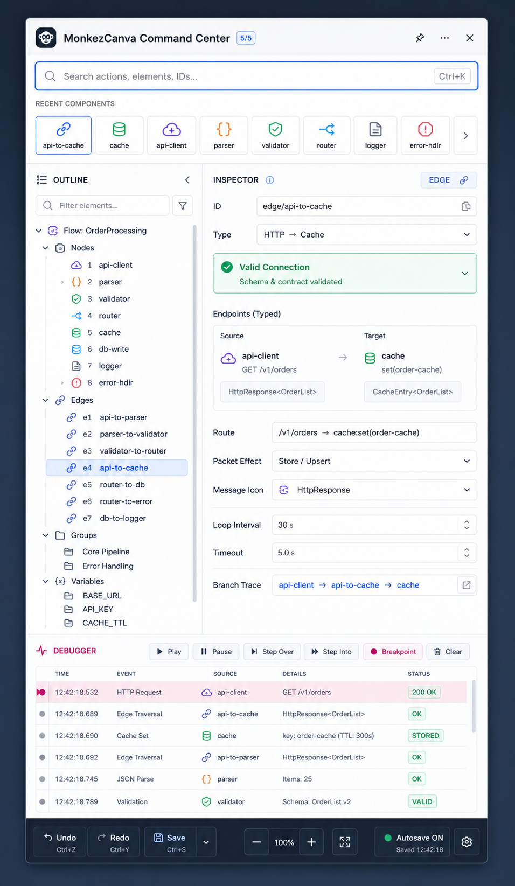

# MonkezCanva Control Pane concepts

Generated: 2026-08-08

These ImageGen concepts explore information architecture and interaction density.
They are product-design references, not pixel-exact implementation contracts.
The production UI must remain native PyQt6, high-DPI aware and usable at narrower
pane widths.

## Option 1 — Precision Light

A clean, approachable Inspector organized into contextual accordion sections.
It shows a connector selected with Identity, Endpoints, Stroke, Animation and
Packet controls. This is the strongest default visual foundation because the
hierarchy is clear and maps directly to reusable native form controls.

Strengths: discoverability, readable field grouping, low implementation risk.
Trade-off: a long selected-object schema requires search, pinned sections and
careful disclosure to avoid excessive scrolling.

## Option 2 — Midnight Graph Studio

An IDE-like dark workspace focused on typed ports, routing rules, connector
animation and packet runtime behavior.

Strengths: excellent graph-editor identity, runtime state visibility and dense
expert workflows. Trade-off: the permanent navigation rail consumes width and
the low-light palette needs strict contrast/accessibility testing.

## Option 3 — Modular Dock

A light detachable panel centered on multi-selection. It combines contextual
Align, Distribute, Group and Lock commands with mixed-value property sections
and a detachable Runtime Console.

Strengths: best multi-object editing model and strong dock/module semantics.
Trade-off: the wide property grid is less suitable for a narrow floating pane
unless fields reflow responsively.

## Option 4 — Industrial Control

A dark SCADA/HMI-oriented Inspector for live equipment, bindings, ports, alarms
and simulation controls.

Strengths: validates that the registry-driven Inspector can support domain
components and live values. Trade-off: too specialized and visually heavy to
be the universal default.

## Option 5 — Command Center

A keyboard-first advanced workspace combining command search, document outline,
typed edge inspection and a packet debugger timeline.

Strengths: strongest architecture for large documents, trace/debug workflows
and expert navigation. Trade-off: too much information for a compact default
pane; it should become an optional expanded workspace.

## Recommended product direction

Build a responsive hybrid:

1. Use Option 1 as the default Inspector shell and visual language.
2. Adopt Option 3's contextual multi-selection actions and mixed-value model.
3. Provide Option 2 as the dark theme and borrow its typed-port presentation.
4. Package Option 4 as an Industrial component/Inspector preset.
5. Introduce Option 5's outline and debugger as detachable or expanded tools
   after the core document model and runtime event stream are stable.

The compact state should show selection identity, search and the most frequently
used contextual sections. The expanded state may expose Outline, Runtime and
Debugger without making the everyday Inspector permanently large.

## Generation brief

Mode: built-in ImageGen, five independent generations. Shared constraints were
a polished native desktop/PyQt control pane, readable labels, icon-led actions,
no browser chrome and no watermark. Each prompt then emphasized one distinct
workflow: connector inspection, dark graph routing, multi-selection editing,
industrial live control or command/debug operations.
